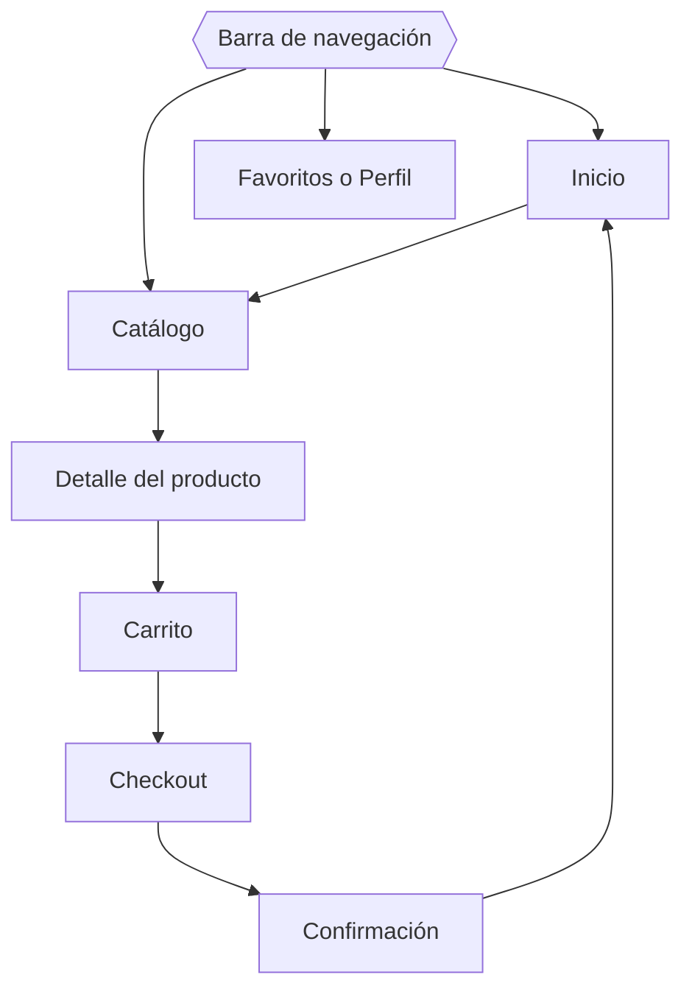

## 1. Justificación del diseño

### 1.1 Importancia del diseño centrado en el usuario

El diseño de Pequeños Pasos parte de las necesidades de quienes compran ropa infantil. La interfaz debe permitir consultar prendas, encontrar la talla correcta y completar la compra de forma clara y sencilla.

El diseño centrado en el usuario organiza la información y las funciones según las tareas reales de las personas. Por eso el prototipo prioriza una navegación comprensible, controles reconocibles y una presentación coherente entre pantallas.

### 1.2 Objetivos del proyecto

**Objetivo general:** diseñar un prototipo navegable de aplicación Android para la tienda infantil Pequeños Pasos, aplicando los principios de Material Design 3 (M3).

**Objetivos específicos de diseño:**

- Diseñar las siete pantallas obligatorias del prototipo.
- Facilitar la exploración del catálogo de ropa infantil de 0 a 14 años.
- Permitir consultar productos, elegir talla y revisar el carrito.
- Mantener coherencia visual mediante color, tipografía, iconografía y componentes reutilizables.

**Objetivos medibles (se evaluarán en las pruebas de la sección 4):**

| Nº | Objetivo medible | Indicador | Meta |
|----|------------------|-----------|------|
| O1 | Completar el recorrido de compra de prueba (Inicio → Confirmación) | Tiempo por persona | ≥ 80 % de participantes en menos de 2 minutos |
| O2 | Localizar un producto y seleccionar una talla correctamente | Tarea completada con la talla pedida | ≥ 90 % de participantes |
| O3 | Completar las tareas de prueba sin ayuda | Tareas sin intervención del observador | ≥ 90 % de las tareas |

### 1.3 Beneficios esperados

- Consulta del catálogo más sencilla.
- Menos dificultad para encontrar productos y tallas.
- Información clara de cada prenda.
- Revisión de la selección antes de pagar.
- Experiencia visual consistente en todas las pantallas.

---

## 2. Investigación y análisis de usuarios

### 2.1 Demografía y segmentación

La app se dirige a personas que compran ropa para niños y niñas de 0 a 14 años:

- Madres, padres y tutores que compran ropa infantil con frecuencia.
- Familiares que compran prendas como regalo.
- Personas que necesitan consultar modelos, tallas y precios antes de decidir.

### 2.2 Necesidades y comportamientos

| Necesidad | Comportamiento o tarea | Respuesta de diseño |
|-----------|------------------------|---------------------|
| Encontrar prendas | Explorar el catálogo por categorías | Categorías por edad en Inicio y filtros en Catálogo |
| Conocer los detalles | Abrir la ficha de una prenda | Carrusel de fotos y precio visible en Detalle |
| Elegir talla | Consultar y seleccionar una opción disponible | Selector de talla propio y guía de tallas |
| Revisar la selección | Consultar los productos añadidos | Pantalla Carrito con resumen del importe |
| Navegar con facilidad | Pasar de una sección a otra | Navigation bar con tres destinos fijos |

### 2.3 Perfiles de usuario (personas)

Los perfiles son ficticios y sirven para orientar el diseño. No representan personas entrevistadas.

#### Persona 1: Laura Martín, 34 años

- **Contexto:** madre de dos hijos (3 y 8 años). Compra ropa desde el móvil, a ratos libres y con poco tiempo.
- **Objetivos:** encontrar prendas y tallas sin recorrer demasiadas pantallas; repetir compras con rapidez.
- **Frustraciones:** no saber qué talla corresponde a la edad de cada hijo; tallas que no coinciden entre marcas; procesos de pago largos.

#### Persona 2: Antonio Ruiz, 62 años

- **Contexto:** abuelo que compra un regalo para sus nietos. Usa el móvil con poca frecuencia y no conoce las tallas actuales.
- **Objetivos:** entender las opciones disponibles y comprar sin ayuda de otra persona.
- **Frustraciones:** texto pequeño, iconos sin etiqueta, botones difíciles de pulsar y no saber si la compra se ha completado.

### 2.4 Análisis de aplicaciones similares

| App | Qué hace bien | Qué hace mal | Qué me llevo |
|-----|---------------|--------------|--------------|
| H&M | _(completar tras probar la app)_ | _(completar)_ | _(completar)_ |
| Zalando | _(completar)_ | _(completar)_ | _(completar)_ |
| Zara | _(completar)_ | _(completar)_ | _(completar)_ |

### 2.5 Hallazgos clave (insights) y decisiones de diseño

| Nº | Insight | Decisión de diseño |
|----|---------|--------------------|
| 1 | Quien compra duda con las tallas, sobre todo si compra para otra persona | Botón «Guía de tallas» en el Detalle, que abre un bottom sheet |
| 2 | Hay que encontrar prendas rápido, por edad antes que por tipo de prenda | Categorías por edad (Bebé 0-24 m, Niña, Niño) en Inicio y filter chips en Catálogo |
| 3 | Al borrar un producto del carrito por error, la persona no quiere empezar de nuevo | Snackbar con acción «Deshacer» al eliminar |
| 4 | Un formulario de pago largo genera abandono y errores | Formulario corto en Checkout, con mensajes de ayuda y estado de error visible |
| 5 | Personas mayores necesitan controles grandes y claros | Áreas táctiles ≥ 48×48 dp, texto legible y navigation bar con etiquetas |

## 3. Diseño de la interfaz

### 3.1 Estructura y navegación

La barra de navegación tiene tres destinos: **Inicio**, **Catálogo** y **Favoritos o Perfil**. El resto de pantallas se recorren dentro del flujo de compra.

